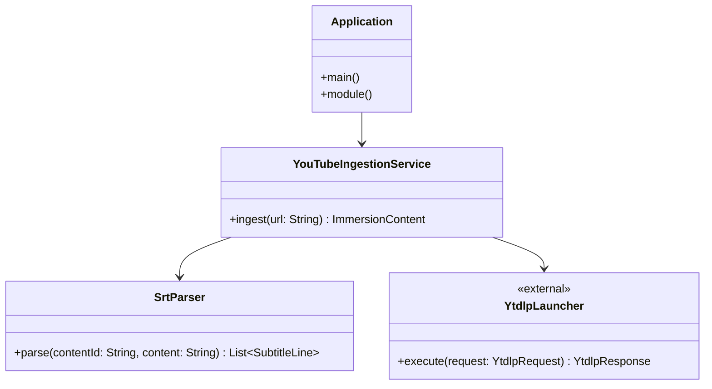
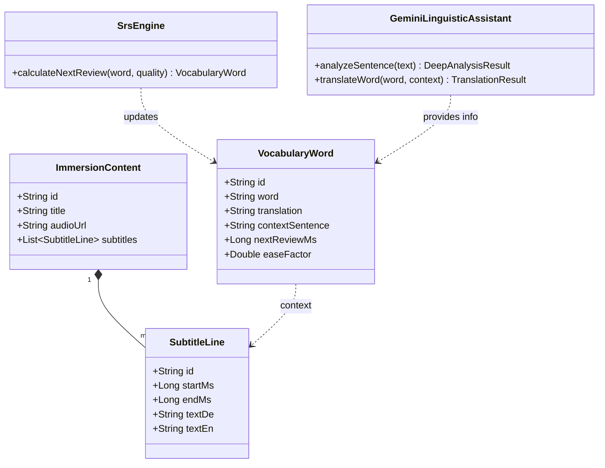

# UML Diagrams

## Backend Ingestion Pattern

```mermaid
classDiagram
    class Application {
        +main()
        +module()
    }
    class YouTubeIngestionService {
        +ingest(url: String) ImmersionContent
    }
    class SrtParser {
        +parse(contentId: String, content: String) List~SubtitleLine~
    }
    class YtdlpLauncher {
        <<external>>
        +execute(request: YtdlpRequest) YtdlpResponse
    }

    Application --> YouTubeIngestionService
    YouTubeIngestionService --> SrtParser
    YouTubeIngestionService --> YtdlpLauncher
```

## Domain Model Relationships

```mermaid
classDiagram
    class ImmersionContent {
        +String id
        +String title
        +String audioUrl
        +List~SubtitleLine~ subtitles
    }
    class SubtitleLine {
        +String id
        +Long startMs
        +Long endMs
        +String textDe
        +String textEn
    }
    class VocabularyWord {
        +String id
        +String word
        +String translation
        +String contextSentence
        +Long nextReviewMs
        +Double easeFactor
    }
    class SrsEngine {
        +calculateNextReview(word, quality) VocabularyWord
    }
    class GeminiLinguisticAssistant {
        +analyzeSentence(text) DeepAnalysisResult
        +translateWord(word, context) TranslationResult
    }

    ImmersionContent "1" *-- "many" SubtitleLine
    VocabularyWord ..> SubtitleLine : context
    SrsEngine ..> VocabularyWord : updates
    GeminiLinguisticAssistant ..> VocabularyWord : provides info
```
