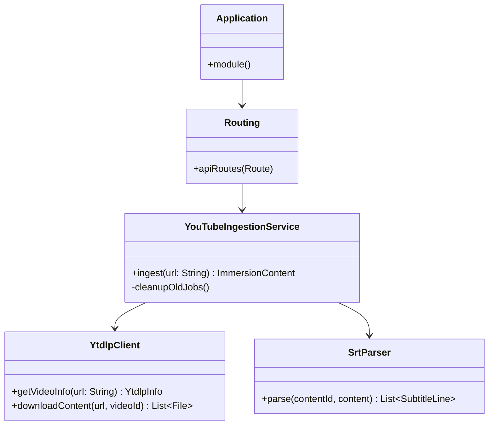
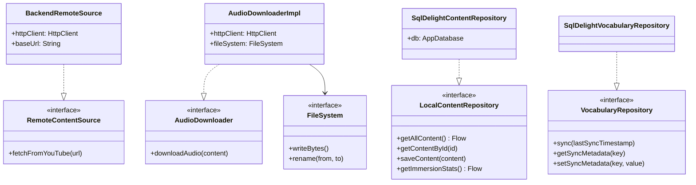
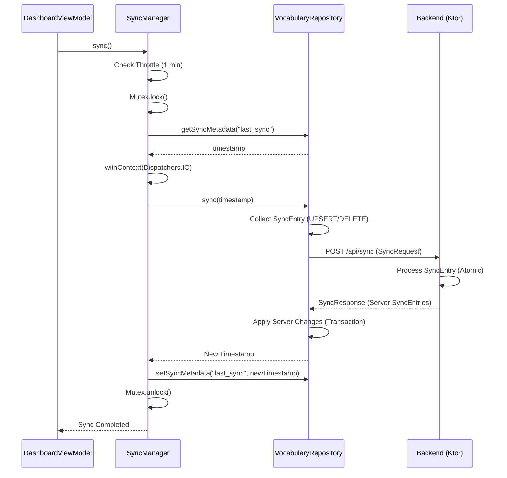
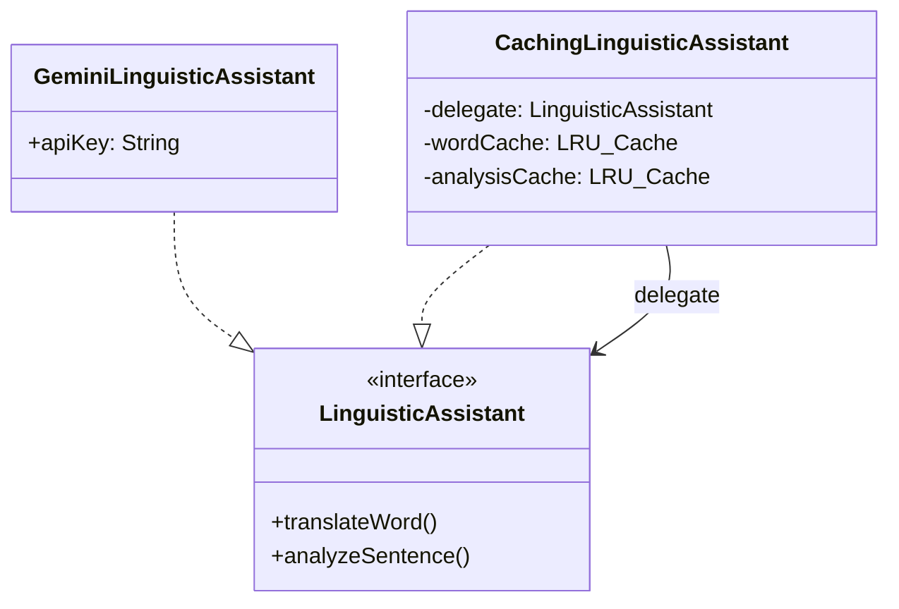
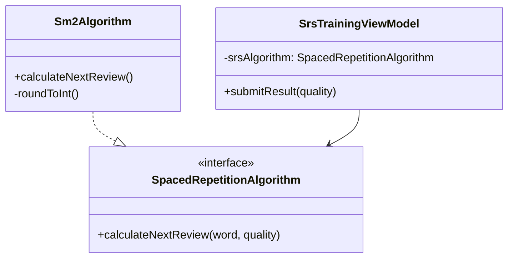
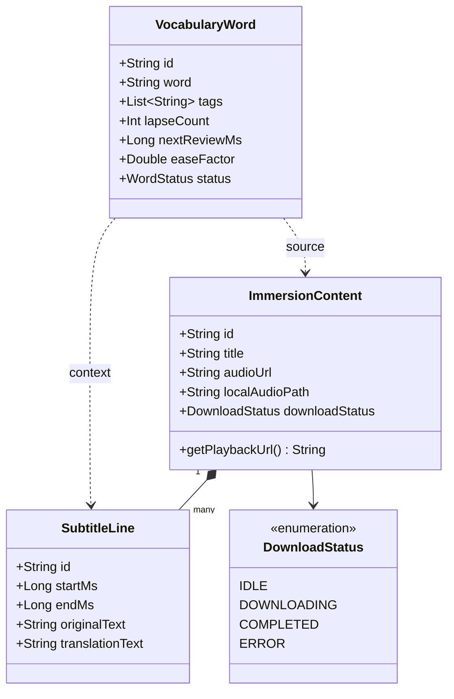

# UML Diagrams

## Backend Architecture (Refactored)

## Repository Architecture (ISP)

## Synchronization Flow (Sequence)

## AI Decorator with LRU Cache

## Spaced Repetition (SRS) Logic

## Domain Model Relationships

