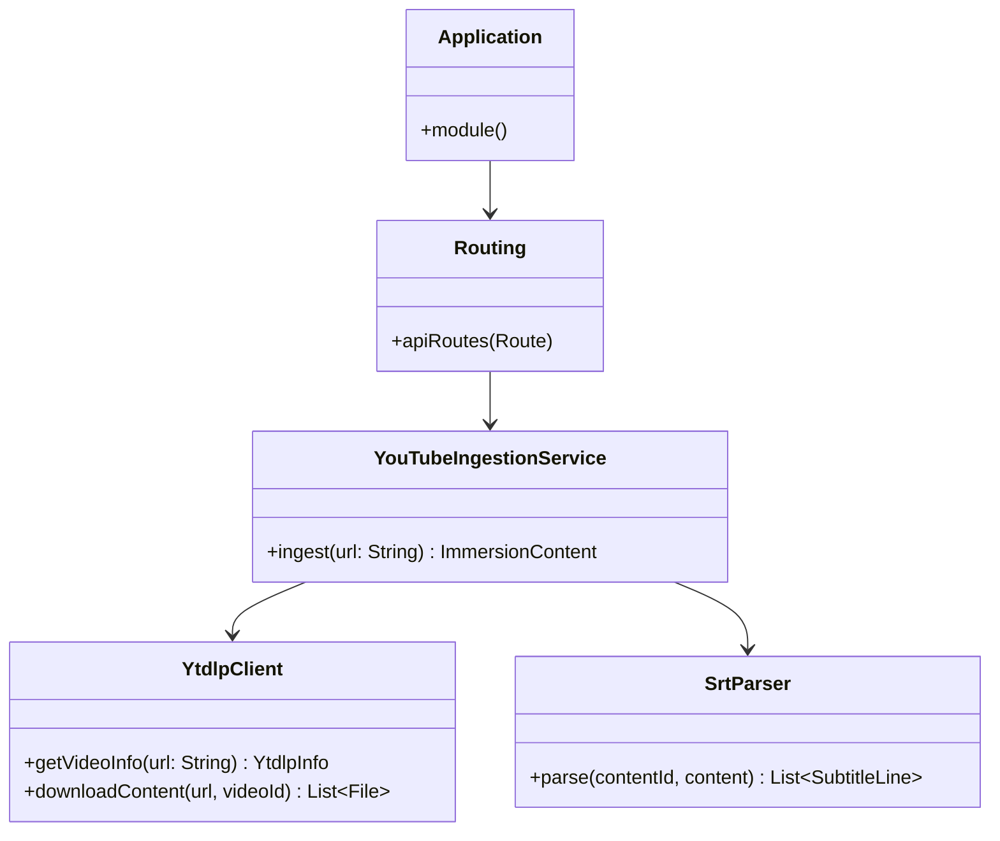
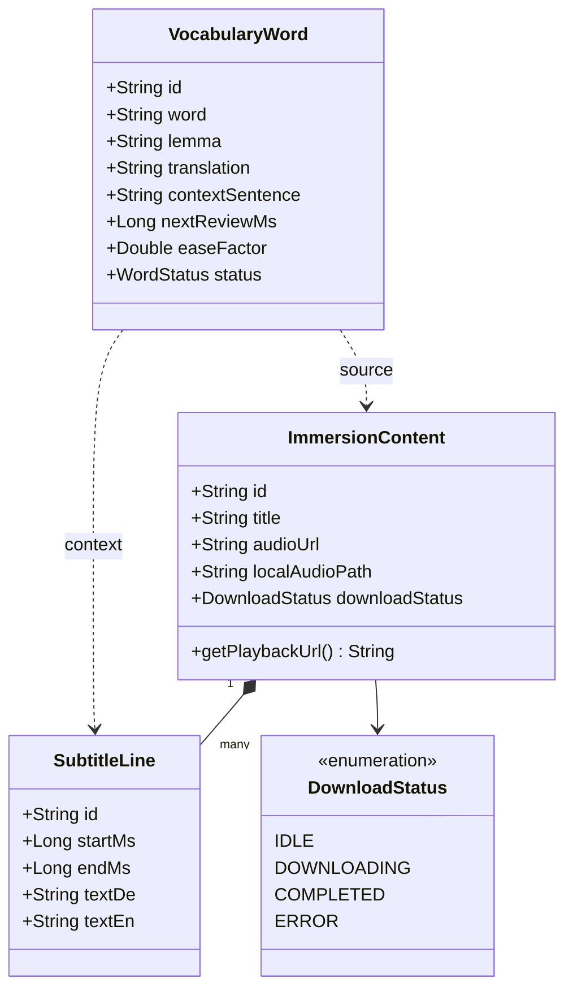
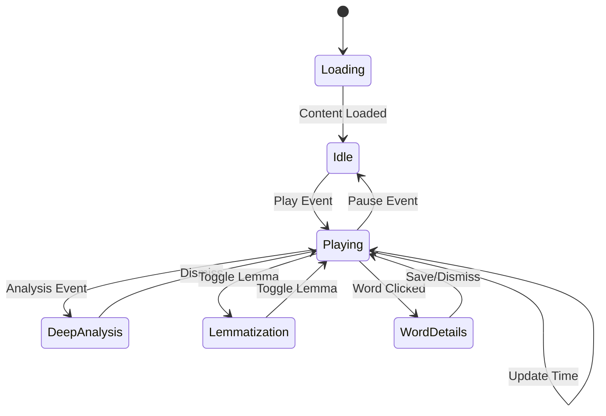

# UML Diagrams

## Backend Architecture (Refactored)

```mermaid
classDiagram
    class Application {
        +module()
    }
    class Routing {
        +apiRoutes(Route)
    }
    class YouTubeIngestionService {
        +ingest(url: String) ImmersionContent
    }
    class YtdlpClient {
        +getVideoInfo(url: String) YtdlpInfo
        +downloadContent(url, videoId) List~File~
    }
    class SrtParser {
        +parse(contentId, content) List~SubtitleLine~
    }

    Application --> Routing
    Routing --> YouTubeIngestionService
    YouTubeIngestionService --> YtdlpClient
    YouTubeIngestionService --> SrtParser
```

## Domain Model Relationships

```mermaid
classDiagram
    class ImmersionContent {
        +String id
        +String title
        +String audioUrl
        +String localAudioPath
        +DownloadStatus downloadStatus
        +getPlaybackUrl() String
    }
    class DownloadStatus {
        <<enumeration>>
        IDLE
        DOWNLOADING
        COMPLETED
        ERROR
    }
    class SubtitleLine {
        +String id
        +Long startMs
        +Long endMs
        +String textDe
        +String textEn
    }
    class VocabularyWord {
        +String id
        +String word
        +String lemma
        +String translation
        +String contextSentence
        +Long nextReviewMs
        +Double easeFactor
        +WordStatus status
    }

    ImmersionContent "1" *-- "many" SubtitleLine
    ImmersionContent --> DownloadStatus
    VocabularyWord ..> SubtitleLine : context
    VocabularyWord ..> ImmersionContent : source
```

## UI State Machine

```mermaid
stateDiagram-v2
    [*] --> Loading
    Loading --> Idle: Content Loaded
    Idle --> Playing: Play Event
    Playing --> Idle: Pause Event
    Playing --> Playing: Update Time
    Playing --> DeepAnalysis: Analysis Event
    DeepAnalysis --> Playing: Dismiss
    Playing --> Lemmatization: Toggle Lemma
    Lemmatization --> Playing: Toggle Lemma
    Playing --> WordDetails: Word Clicked
    WordDetails --> Playing: Save/Dismiss
```
